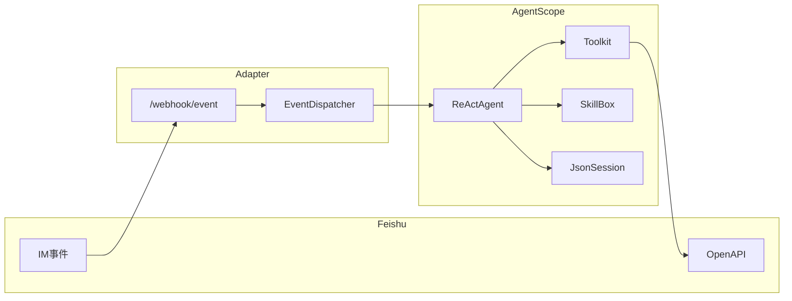
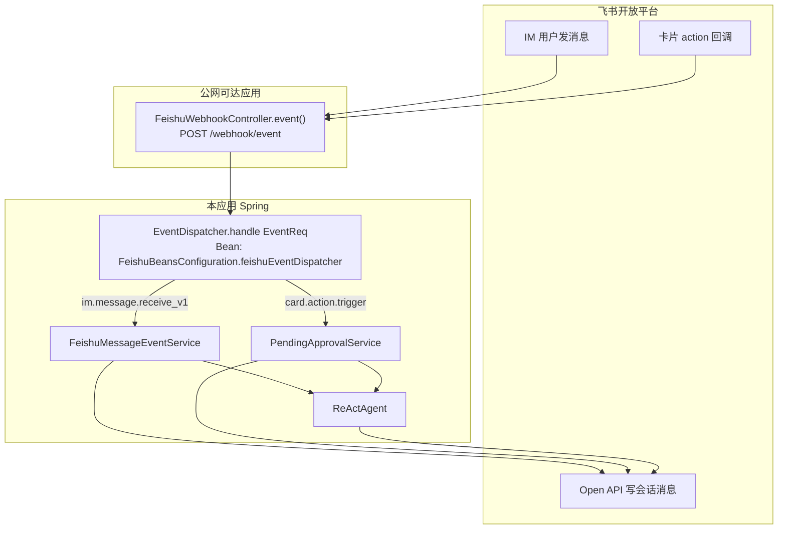
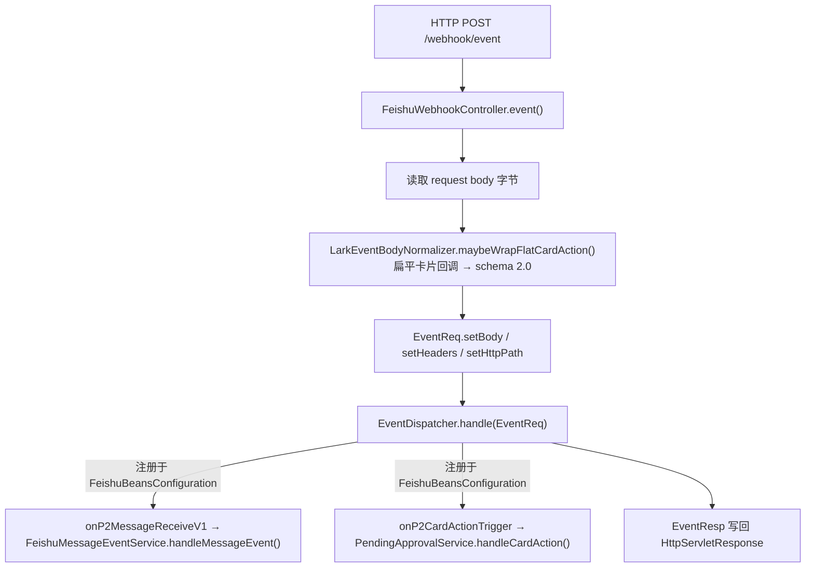
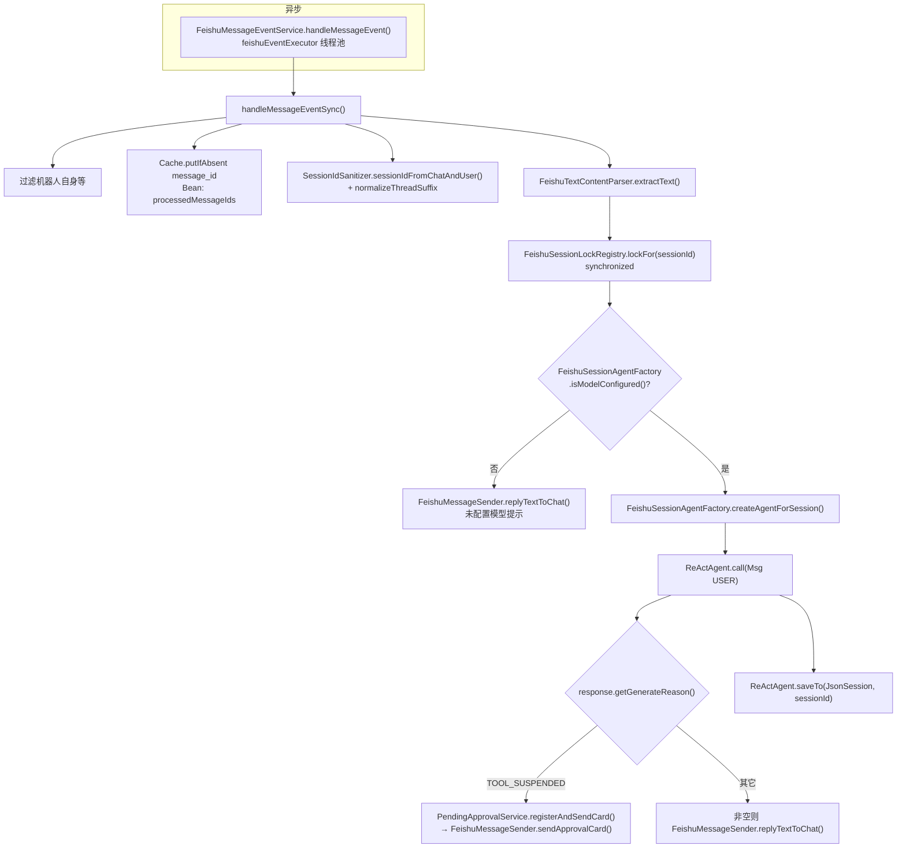
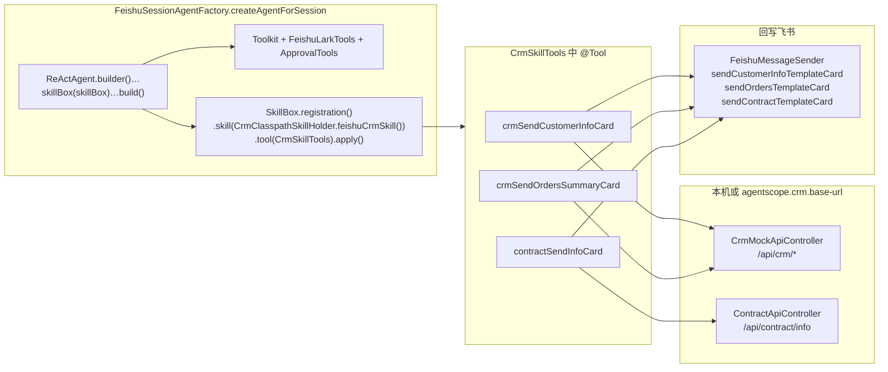
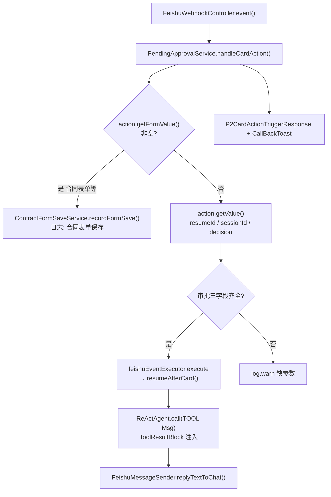
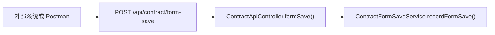

# agentscope-feishu

基于 **AgentScope Java** 与 **飞书开放平台（Lark / Feishu）** 的示例集成：在 IM 中接收用户消息，经 **ReActAgent** 推理与工具调用后，通过 Open API 回复；支持 **JsonSession** 会话持久化、**message_id** 幂等、以及 **ToolSuspend + 交互卡片** 的人机协同（HITL）演示。

---

## 背景与定位

飞书负责 **消息通道与用户交互形态**（事件订阅、发消息、卡片回调）；AgentScope Java 负责 **推理—工具—记忆**（`ReActAgent`、`Toolkit`、`Session`、`Hook` 等）。二者通过薄适配层完成 **飞书事件 ↔ `Msg`** 的映射。

典型可扩展场景包括：单聊/群 Copilot、企业知识助手（结合文档 API + AgentScope RAG）、办公工具链（日程/多维表格等封装为 `@Tool`）、运维告警机器人、以及多智能体在服务端编排后仍由单一机器人入口对外。

---

## 技术栈与版本

| 组件 | 说明 |
|------|------|
| JDK | 17+ |
| Spring Boot | 3.3.x（Jakarta Servlet） |
| AgentScope Java | `io.agentscope:agentscope` 1.0.12 |
| 飞书 SDK | `com.larksuite.oapi:oapi-sdk` 2.4.19 |
| 其他 | Caffeine（消息幂等）、Project Reactor（AgentScope 异步） |

模型侧当前示例使用 **阿里云 DashScope（通义）**；亦可按 [AgentScope 安装文档](https://java.agentscope.io/) 替换为 OpenAI 等兼容实现。

---

## 架构概览



- **Webhook**：`FeishuWebhookController` 将 HTTP 请求体与 Header 转为 `EventReq`，调用 `EventDispatcher.handle`（无需旧版 `ServletAdapter` 的 `javax.servlet`）。
- **异步**：`im.message.receive_v1` 在 `feishuEventExecutor` 中异步处理，避免阻塞飞书回调线程。
- **会话**：`sessionId = sanitize(chatId) + "_" + sanitize(openId)`，可选话题群追加 `_t_<threadId>`；`JsonSession` 持久化目录可配置。
- **并发**：同一 `sessionId` 使用 `FeishuSessionLockRegistry` 互斥；**每个请求新建 `ReActAgent` 实例**（符合 AgentScope「有状态 Agent 不可并发共享」约束）。

---

## 全流程流程图（用户输入 → 飞书可见输出）

以下从**飞书用户行为**出发，标出本仓库中的**核心类与核心方法**；飞书开放平台与公网入口（如 ngrok）为外部依赖，图中一并标出。

### 1. 端到端总览



说明：**用户可见输出**均通过飞书 **Open API**（`com.lark.oapi.Client`，由 `FeishuBeansConfiguration.larkClient()` 创建）发回会话，例如 `FeishuMessageSender.replyTextToChat` / `sendInteractiveTemplate` / `sendApprovalCard`。

---

### 2. Webhook 入口与事件分发（所有飞书事件共用）



要点：`EventDispatcher` 在 `FeishuBeansConfiguration.feishuEventDispatcher()` 中构建，使用 `FeishuProperties` 的 **Verification Token** 与 **Encrypt Key** 做签名校验/解密（由 SDK 处理）。

---

### 3. 分支 A：用户在会话里发**文本**（`im.message.receive_v1`）



**核心类与方法速查（文本分支）**

| 步骤 | 类 | 方法 / 说明 |
|------|-----|----------------|
| 入队异步 | `FeishuMessageEventService` | `handleMessageEvent` → `handleMessageEventSync` |
| 幂等 | `Cache<String,Boolean>` | `putIfAbsent(messageId)`，Bean 名 `processedMessageIds` |
| 会话键 | `SessionIdSanitizer` | `sessionIdFromChatAndUser`、`normalizeThreadSuffix` |
| 正文 | `FeishuTextContentParser` | `extractText(messageType, content)` |
| 合同查询（含「查询…合同」） | `ReActAgent` + `feishu_crm` 技能 | 模型 `load_skill_through_path` 后必须 `contract_send_info_card`（见 `SKILL.md` 强制规则） |
| Agent | `FeishuSessionAgentFactory` | `createAgentForSession` → `ReActAgent.builder()…skillBox…build()`，`loadIfExists(JsonSession)` |
| 推理 | `ReActAgent` | `call(Msg)`（Project Reactor `block()` 在 `FeishuMessageEventService`） |
| HITL | `PendingApprovalService` | `registerAndSendCard`；恢复见下文分支 B |
| 回写飞书 | `FeishuMessageSender` | `replyTextToChat`、`sendInteractiveTemplate`（模板卡片）、`sendApprovalCard` |
| 持久化 | `ReActAgent` + `Session` | `saveTo`；`Session` 实现为 `JsonSession`（`FeishuBeansConfiguration.agentscopeJsonSession`） |

---

### 4. 分支 A 延伸：Agent 内 **Skill + 工具** → Mock API → 再发飞书卡片（CRM / 合同）

合同、CRM 等均由 **ReActAgent** 经 **SkillBox** 渐进加载 `feishu_crm` 并调用 `CrmSkillTools`（框架提供 `load_skill_through_path` 等）；合同句式约束见 `skills/feishu_crm/SKILL.md` 与系统提示。



**变量映射**：`CustomerInfoCardVariables` / `OrdersCardVariables` / `ContractCardVariables` → `FeishuMessageSender` 内私有 `sendInteractiveTemplate(chatId, templateId, version, templateVariable)` → `Client.im().message().create()`。

---

### 5. 分支 B：用户点击**卡片**（`card.action.trigger`）



**`resumeAfterCard` 要点**（`PendingApprovalService` 私有方法）：`pendingByResumeId.remove(resumeId)` 取回挂起的 `ReActAgent`，构造 `ToolResultBlock`，再 `agent.call(toolMsg)`，最后 `replyTextToChat` 与 `saveTo`。

---

### 6. 可选：HTTP 直连保存合同表单（非飞书默认路径）



飞书卡片按钮**默认**不会请求此 URL；与分支 B 中 `ContractFormSaveService` 为**同一套**落日志逻辑。

---

## 仓库结构（核心代码）

```
src/main/java/io/agentscope/feishu/
├── AgentscopeFeishuApplication.java    # 启动类
├── agent/
│   └── FeishuSessionAgentFactory.java  # ReActAgent + Toolkit + Session 加载/保存
├── config/
│   ├── FeishuBeansConfiguration.java   # Client、EventDispatcher、JsonSession、线程池
│   └── FeishuProperties.java           # agentscope.feishu.* 配置
├── crm/                                 # CRM Mock REST、卡片变量、Skill 绑定工具（见下文「CRM（Skill）」）
│   ├── CrmRemoteClient.java
│   ├── CrmReplyFormatter.java
│   ├── skill/                           # classpath 技能 feishu_crm 的 Java 适配
│   │   ├── CrmClasspathSkillHolder.java
│   │   └── CrmSkillTools.java
│   └── web/CrmMockApiController.java    # GET /api/crm/customerInfo、/api/crm/orders
├── contract/                            # 合同 Mock：GET /api/contract/info、POST /api/contract/form-save
│   ├── ContractCardVariables.java
│   ├── ContractFormSaveService.java     # 与 HTTP form-save 同日志逻辑；卡片回调也走此服务
│   ├── ContractRemoteClient.java
│   └── web/ContractApiController.java
├── lark/
│   ├── LarkEventBodyNormalizer.java     # 扁平卡片回调 → schema 2.0，供 EventDispatcher 识别
│   ├── FeishuMessageEventService.java   # 收消息：幂等、串行、ReActAgent（含 SkillBox）、TOOL_SUSPENDED
│   ├── FeishuMessageSender.java         # 发文本 / 交互卡片
│   ├── FeishuTextContentParser.java     # 解析 text 消息 content JSON
│   └── PendingApprovalService.java      # 卡片回调：表单保存打印日志；审批恢复 ToolSuspend
├── session/
│   ├── SessionIdSanitizer.java          # sessionId 安全校验（防路径穿越）
│   └── FeishuSessionLockRegistry.java
├── tools/
│   ├── FeishuLarkTools.java             # 飞书 API → @Tool（Mono）
│   ├── FeishuToolContext.java         # chatId 注入（ToolExecutionContext）
│   └── ApprovalTools.java             # ToolSuspend 演示
└── web/
    └── FeishuWebhookController.java     # POST /webhook/event

src/main/resources/skills/feishu_crm/    # AgentScope 技能包：SKILL.md + references（ClasspathSkillRepository 根为 skills/）
```

---

## 功能交付清单

| 能力 | 说明 |
|------|------|
| 事件订阅 | `im.message.receive_v1`；卡片 **`card.action.trigger`（P2CardActionTrigger）** 用于审批恢复 |
| 消息回复 | `CreateMessage` 向当前 `chat_id` 发文本；交互卡片 schema `2.0` |
| Agent | `ReActAgent` + DashScope；未配置模型 Key 时对用户文本做 Echo 提示 |
| Session | `JsonSession`，`loadIfExists` / `saveTo`；目录见 `agentscope.feishu.session-dir` |
| 飞书 Tool | `getCurrentChatMetadata`、`sendFollowUpTextToCurrentChat`（`Mono`）；`feishuPing` 演示 **presetParameters** |
| 幂等 | `message_id` 写入 Caffeine，TTL 可配置 |
| HITL | `request_sensitive_action_approval` 抛 `ToolSuspendException` → 发卡片 → 回调里 `agent.call` 工具结果消息并继续推理 |
| **CRM / 合同（Skill）** | 用户消息进入 `ReActAgent`；技能 `feishu_crm` 内 `crm_send_*` / `contract_send_info_card` → 对应 Mock HTTP + **飞书模板卡片**（失败回退纯文本）；合同卡片表单提交在回调中 **INFO 打印** `formValue`，亦可 `POST /api/contract/form-save` 打印 JSON |

### CRM（AgentScope Skill）

CRM 能力仅通过 **Skill + 渐进式工具** 提供：`FeishuSessionAgentFactory` 为每个会话挂载 `SkillBox`，技能定义在 `src/main/resources/skills/feishu_crm/`（`SKILL.md` + `references/`），Java 适配在 `io.agentscope.feishu.crm.skill`（`CrmClasspathSkillHolder`、`CrmSkillTools`）。

推荐用户话术（与 `references/crm-patterns.md` 一致；公司名可替换，`陕西中辰海锋新能源有限公司` 为 Mock 富数据示例）：

| 用户输入 | 后端效果（由模型调用工具完成） |
|---------|------|
| `查询<公司> 客户基本信息` | `crm_send_customer_info_card` → `GET /api/crm/customerInfo` |
| `查询<公司>`（整句不含「订单」） | 同上 |
| `查询<公司>订单量` | `crm_send_orders_summary_card(..., ALL)` → `GET /api/crm/orders` |
| `查询<公司>已结算的订单量` | `crm_send_orders_summary_card(..., SETTLED)` |
| `查询HT-20250908192882合同` 等 | 经 Agent：`load_skill` + `contract_send_info_card` → `GET /api/contract/info` → 模板 `AAqtmy18CRaGt`（`SKILL.md` 约定必须走工具发卡片） |

配置：`agentscope.crm.base-url`（留空则 `http://127.0.0.1:{server.port}`，**合同接口与同 base**）；`agentscope.contract.card-template-id` 等见 `application.yml`。

客户信息卡片（与 [飞书文档：使用指定应用发送飞书卡片](https://open.feishu.cn/document/feishu-cards/quick-start/send-feishu-cards-with-app-bots) 一致）：

- `agentscope.crm.customer-info-use-template-card`：是否用模板卡片（默认 `true`）。
- `agentscope.crm.customer-info-card-template-id`：搭建工具中的卡片 ID（默认 `AAqtrZyWSproW`，可用环境变量 `FEISHU_CUSTOMER_CARD_TEMPLATE_ID` 覆盖）。
- `agentscope.crm.customer-info-card-template-version`：模板版本号，留空使用平台最新已发布版本。

接口字段 → 卡片变量映射见 `CustomerInfoCardVariables`（`baseCompanyName`、`baseCompanyBizCode`、`baseCompanyType` 等）。

订单统计卡片（模板 ID 默认 `AAqtroVtGb0Yc`）：

- `agentscope.crm.orders-use-template-card`、`orders-card-template-id`、`orders-card-template-version`（或环境变量 `FEISHU_ORDERS_CARD_TEMPLATE_*`）。
- 变量映射见 `OrdersCardVariables`：`companyName`、`unSettledNum`、`settledNum`、`invoicedNum`、`totalNum`（均为字符串传入模板）。`/api/crm/orders` 的 Mock 会按请求中的 **companyName** 生成数据（演示企业为富数据，其它为基于名称 hash 的确定性占位）。

句式 **`查询<合同编号>合同`** 与 CRM 话术一样 **一律进 `ReActAgent`**，由 `feishu_crm` 技能与 `contract_send_info_card` 工具发模板卡片（系统提示 + `SKILL.md` 强制规则约束模型，不得只回纯文本替代卡片）。

合同表单保存：**飞书不会请求** `POST /api/contract/form-save`（除非你在卡片里把按钮配置成自定义请求地址）。默认流程是 **`card.action.trigger` → `/webhook/event`**。`FeishuWebhookController` 会用 `LarkEventBodyNormalizer` 把飞书先发到的**扁平 JSON**包成 `schema 2.0` 信封，避免 `HandlerNotFoundException`。`PendingApprovalService` 收到带 `form_value` 的按钮回调后，调用与 HTTP 相同的 **`ContractFormSaveService`**，日志前缀同为 **`[合同表单保存]`**。联调或网关仍可直接 `POST /api/contract/form-save`。

其它非业务查询仍由同一 `ReActAgent` 与通用飞书工具处理。

---

## 快速开始

### 1. 环境变量（推荐，勿将密钥写入 Git）

| 变量 | 含义 |
|------|------|
| `FEISHU_APP_ID` | 飞书自建应用 App ID |
| `FEISHU_APP_SECRET` | 飞书自建应用 App Secret |
| `FEISHU_VERIFICATION_TOKEN` | 事件订阅 Verification Token |
| `FEISHU_ENCRYPT_KEY` | 事件加密 Encrypt Key（启用加密时必填） |
| `AGENTSCOPE_MODEL_DASHSCOPE_API_KEY` | DashScope API Key |
| `AGENTSCOPE_MODEL_NAME` | 模型名，默认可用 `qwen-turbo` 等 |

应用内等价配置前缀：`agentscope.feishu.*`、`agentscope.model.*`（见 `src/main/resources/application.yml`）。

### 2. 飞书开放平台配置（摘要）

1. 创建企业自建应用，启用 **机器人**，开通 **接收消息** 等相关权限。  
2. **事件订阅**：配置请求地址 `https://<你的公网域名>/webhook/event`，订阅 **接收消息 v2.0**（`im.message.receive_v1`）。  
3. 若使用审批卡片：订阅 **卡片 action** 对应事件（与 SDK 中 `P2CardActionTrigger` 一致），同一 URL 或按控制台要求配置。  
4. 将控制台中的 **Verification Token / Encrypt Key** 与代码或环境变量对齐。

### 3. 构建与运行

```bash
mvn test
mvn spring-boot:run
```

默认 HTTP 端口见 `application.yml` 中 `server.port`（可改为 `8080` 等）。

### 4. 健康检查

可自行增加 `GET /actuator/health`（需引入 `spring-boot-starter-actuator`）；当前仓库未默认开启。

---

## 安全与合规提示

- **密钥与 Token**：务必通过环境变量或私密配置中心注入；**不要**把 `app_secret`、模型 API Key、verification token 提交到公开仓库。  
- **sessionId**：仅允许安全字符，防止 JsonSession 目录穿越（实现见 `SessionIdSanitizer`）。  
- **日志 / 会话文件**：可能含用户内容与提示词，生产环境需脱敏、限权与留存策略。  
- **幂与重推**：飞书可能对事件重推；`message_id` 去重可降低重复回复风险。

---

## 测试

```bash
mvn test
```

包含 `SessionIdSanitizerTest` 等对会话主键规则的单元测试。

---

## 延伸阅读

- [AgentScope Java 文档](https://java.agentscope.io/)  
- [飞书开放平台 - 接收消息事件](https://open.feishu.cn/document/server-docs/im-v1/message/events/receive)  
- 本仓库实现对应调研中的 **Webhook 接入层 + Session 隔离 + Toolkit 飞书工具 + 异步与幂等 + 卡片恢复 ToolSuspend**；若需 **WebSocket 长连接** 接收事件，可在同应用内并行接入飞书 SDK 的长连接模式（与当前 HTTP 回调正交）。

---

## License

若无特别声明，以仓库根目录 `LICENSE` 为准（若尚未添加，请自行补充）。
